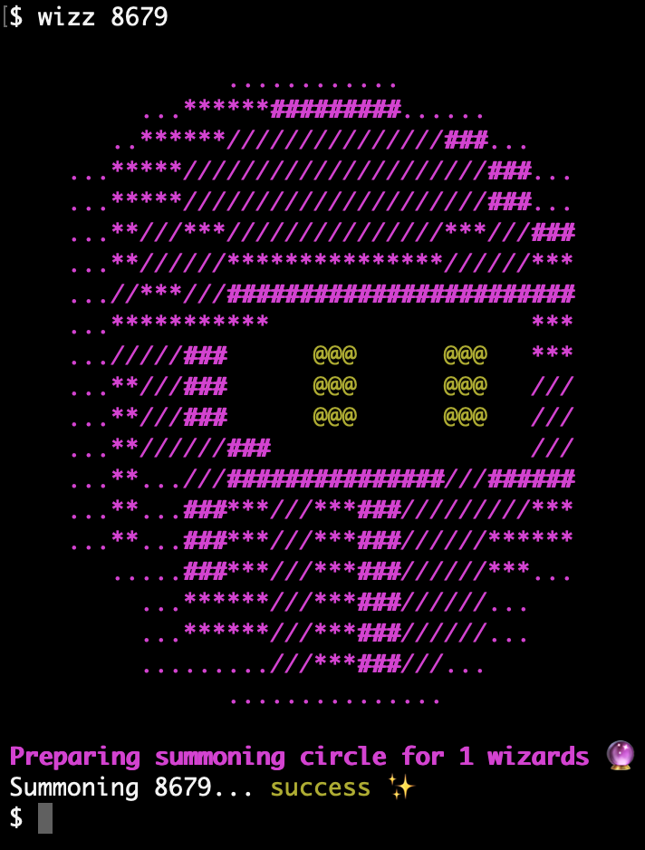

# 🧙🏼‍♂️ Wizz, a FRWC artwork fetcher

Wizz is a bash script to simplify the process of downloading artwork for any given character from Forgotten Runes Wizard Cult - <https://forgottenrunes.com>. The artwork bundles contain, at the time of this writing, the original artwork for the NFT as well as complete turnarounds.

### 🔮 Usage

The script is simple to use; Either supply a list of wizard IDs as arguments, or run without arguments to enter interactive mode.

For example `$ ./wizz.sh 8679` will download and extract the artwork for wizard numer 8670, aka. Sorcerer Ilyas of the Fey, to the current working directory.

